# PathPiper Platform Architecture Flow Diagram

## Complete End-to-End User Journey & System Architecture

```mermaid
graph TB
    %% Entry Points
    Start([User Visits PathPiper]) --> Landing[Landing Page]
    Landing --> AuthChoice{Authentication Choice}
    
    %% Authentication Flow
    AuthChoice -->|New User| SignupRole[Role Selection]
    AuthChoice -->|Existing User| Login[Login Page]
    
    SignupRole --> StudentReg[Student Registration]
    SignupRole --> MentorReg[Mentor Registration]
    SignupRole --> InstReg[Institution Registration]
    
    %% Registration Flows
    StudentReg --> StudentOnboard[Student Onboarding]
    MentorReg --> MentorOnboard[Mentor Onboarding]
    InstReg --> InstOnboard[Institution Onboarding]
    
    Login --> AuthMiddleware{Authentication Middleware}
    
    %% Onboarding Steps
    StudentOnboard --> PersonalInfo[Personal Information]
    PersonalInfo --> InterestSelect[Interest Selection]
    InterestSelect --> GoalSetting[Goal Setting]
    GoalSetting --> SkillAssess[Skills Assessment]
    SkillAssess --> StudentDash[Student Dashboard]
    
    MentorOnboard --> MentorPersonal[Mentor Personal Info]
    MentorPersonal --> ExpertiseDef[Expertise Definition]
    ExpertiseDef --> ExperienceDoc[Experience Documentation]
    ExperienceDoc --> AvailabilitySet[Availability Settings]
    AvailabilitySet --> MentorDash[Mentor Dashboard]
    
    InstOnboard --> InstInfo[Institution Information]
    InstInfo --> ProgramsShow[Programs Showcase]
    ProgramsShow --> EventsCal[Events Calendar]
    EventsCal --> GallerySetup[Gallery Setup]
    GallerySetup --> InstDash[Institution Dashboard]
    
    %% Main Platform Features
    AuthMiddleware -->|Valid Token| MainPlatform{Main Platform}
    
    MainPlatform --> Feed[Feed System]
    MainPlatform --> Explore[Explore Section]
    MainPlatform --> Profile[Profile Management]
    MainPlatform --> Circles[Circles/Networking]
    
    %% Feed System
    Feed --> CreatePost[Create Posts]
    Feed --> ViewContent[View Content]
    Feed --> Interact[Like/Comment/Share]
    Feed --> ContentFilter[Content Filtering]
    
    %% Explore System
    Explore --> SearchPeople[Search People]
    Explore --> SearchInst[Search Institutions]
    Explore --> DiscoverContent[Discover Content]
    Explore --> FindEvents[Find Events]
    
    %% Profile System
    Profile --> StudentProfile[Student Profile View]
    Profile --> MentorProfile[Mentor Profile View]
    Profile --> InstProfile[Institution Profile View]
    Profile --> EditProfile[Edit Profile]
    
    %% Circles/Networking
    Circles --> PeerConnect[Peer Connections]
    Circles --> MentorConnect[Mentorship Connections]
    Circles --> InstConnect[Institution Affiliations]
    Circles --> GroupJoin[Interest Groups]
    
    %% Backend Architecture
    subgraph "Backend Services"
        SupabaseAuth[Supabase Authentication]
        SupabaseDB[(Supabase PostgreSQL Database)]
        SupabaseStorage[Supabase Storage]
        ServerActions[Next.js Server Actions]
        API[API Routes]
        Middleware[Auth Middleware]
    end
    
    %% Database Tables
    subgraph "Database Schema"
        UserTables[(User Tables)]
        ProfileTables[(Profile Tables)]
        ContentTables[(Content Tables)]
        ConnectionTables[(Connection Tables)]
        EducationTables[(Educational Tables)]
    end
    
    %% External Integrations
    subgraph "External Services"
        EmailService[Email Service]
        ImageStorage[Image Storage]
        RealTime[Real-time Updates]
    end
    
    %% Security & Safety
    subgraph "Security Layer"
        RLS[Row Level Security]
        AgeFilter[Age-Appropriate Filtering]
        ContentMod[Content Moderation]
        ParentalConsent[Parental Consent]
    end
    
    %% Data Flow Connections
    StudentDash --> Feed
    MentorDash --> Feed
    InstDash --> Feed
    
    Feed --> SupabaseDB
    Explore --> SupabaseDB
    Profile --> SupabaseDB
    Circles --> SupabaseDB
    
    SupabaseAuth --> UserTables
    ServerActions --> ProfileTables
    API --> ContentTables
    
    CreatePost --> ContentMod
    ViewContent --> AgeFilter
    StudentReg --> ParentalConsent
    
    %% Real-time Features
    Feed --> RealTime
    Circles --> RealTime
    
    %% File Upload Flow
    EditProfile --> ImageStorage
    InstOnboard --> ImageStorage
    
    %% Age Verification Flow
    StudentReg --> AgeVerify{Age Verification}
    AgeVerify -->|Under 16| ParentalConsent
    AgeVerify -->|16+| StudentOnboard
    ParentalConsent --> StudentOnboard
```

## Key Architecture Components

### 1. **Frontend Architecture (Next.js 14)**
- **App Router** for routing
- **Server Components** for data fetching
- **Client Components** for interactivity
- **Tailwind CSS + shadcn/ui** for styling

### 2. **Authentication & Authorization**
- **Supabase Auth** for user management
- **Custom middleware** for route protection
- **Role-based access control** (Student/Mentor/Institution)
- **Age verification** and parental consent

### 3. **Database Architecture (PostgreSQL via Supabase)**
- **Row-Level Security (RLS)** for data protection
- **Normalized schema** for users, profiles, content
- **Real-time subscriptions** for live updates

### 4. **Core Platform Features**
- **Multi-type onboarding** flows
- **Personalized feed** system
- **Discovery and exploration** tools
- **Social networking** (Circles)
- **Profile management** per user type

### 5. **Safety & Security**
- **Age-appropriate content** filtering
- **Content moderation** system
- **Privacy controls** and settings
- **Parental monitoring** for minors

### 6. **Real-time Features**
- **Live feed updates**
- **Real-time notifications**
- **Connection status**
- **Activity tracking**

## User Journey Flows

### **Student Journey:**
1. Landing → Registration → Age Verification → Onboarding → Dashboard → Platform Features

### **Mentor Journey:**
1. Landing → Registration → Professional Verification → Onboarding → Dashboard → Mentorship Tools

### **Institution Journey:**
1. Landing → Registration → Institution Verification → Onboarding → Dashboard → Student Engagement Tools

This architecture ensures scalability, security, and age-appropriate interactions while providing a rich educational social platform experience.
