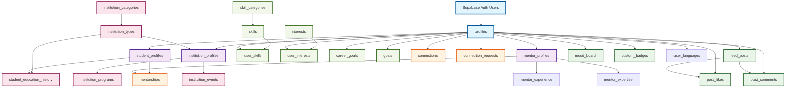

```mermaid
graph TB
    %% Core User Authentication & Profiles
    AUTH[Supabase Auth Users]
    PROFILE[profiles]
    STUDENT[student_profiles]
    MENTOR[mentor_profiles]
    INSTITUTION[institution_profiles]
    
    %% Educational Structure
    INST_CAT[institution_categories]
    INST_TYPE[institution_types]
    EDU_HISTORY[student_education_history]
    
    %% Skills & Interests System
    SKILL_CAT[skill_categories]
    SKILLS[skills]
    USER_SKILLS[user_skills]
    INTERESTS[interests]
    USER_INT[user_interests]
    
    %% Goals & Career Management
    CAREER_GOALS[career_goals]
    GOALS[goals]
    
    %% Social & Connection System
    CONNECTIONS[connections]
    CONN_REQ[connection_requests]
    MENTORSHIPS[mentorships]
    
    %% Content & Media
    FEED_POSTS[feed_posts]
    POST_LIKES[post_likes]
    POST_COMMENTS[post_comments]
    MOOD_BOARD[mood_board]
    CUSTOM_BADGES[custom_badges]
    
    %% Institution Features
    INST_PROGRAMS[institution_programs]
    INST_EVENTS[institution_events]
    
    %% Mentor Features
    MENTOR_EXP[mentor_experience]
    MENTOR_EXPERTISE[mentor_expertise]
    
    %% User Preferences & Settings
    USER_LANG[user_languages]
    
    %% Primary Relationships
    AUTH --> PROFILE
    PROFILE --> STUDENT
    PROFILE --> MENTOR
    PROFILE --> INSTITUTION
    
    %% Education System
    INST_CAT --> INST_TYPE
    INST_TYPE --> EDU_HISTORY
    INST_TYPE --> INSTITUTION
    STUDENT --> EDU_HISTORY
    
    %% Skills Framework
    SKILL_CAT --> SKILLS
    SKILLS --> USER_SKILLS
    PROFILE --> USER_SKILLS
    
    %% Interests System
    INTERESTS --> USER_INT
    PROFILE --> USER_INT
    
    %% Goals & Career
    PROFILE --> CAREER_GOALS
    PROFILE --> GOALS
    
    %% Social Connections
    PROFILE --> CONNECTIONS
    PROFILE --> CONN_REQ
    STUDENT --> MENTORSHIPS
    MENTOR --> MENTORSHIPS
    
    %% Content Creation
    PROFILE --> FEED_POSTS
    PROFILE --> POST_LIKES
    PROFILE --> POST_COMMENTS
    FEED_POSTS --> POST_LIKES
    FEED_POSTS --> POST_COMMENTS
    PROFILE --> MOOD_BOARD
    PROFILE --> CUSTOM_BADGES
    
    %% Institution Features
    INSTITUTION --> INST_PROGRAMS
    INSTITUTION --> INST_EVENTS
    
    %% Mentor Specialization
    MENTOR --> MENTOR_EXP
    MENTOR --> MENTOR_EXPERTISE
    
    %% User Preferences
    PROFILE --> USER_LANG
    
    %% Styling
    classDef coreEntity fill:#e1f5fe,stroke:#01579b,stroke-width:3px
    classDef profileEntity fill:#f3e5f5,stroke:#4a148c,stroke-width:2px
    classDef contentEntity fill:#e8f5e8,stroke:#1b5e20,stroke-width:2px
    classDef socialEntity fill:#fff3e0,stroke:#e65100,stroke-width:2px
    classDef educationEntity fill:#fce4ec,stroke:#880e4f,stroke-width:2px
    classDef skillEntity fill:#f1f8e9,stroke:#33691e,stroke-width:2px
    
    class AUTH,PROFILE coreEntity
    class STUDENT,MENTOR,INSTITUTION profileEntity
    class FEED_POSTS,POST_LIKES,POST_COMMENTS,MOOD_BOARD,CUSTOM_BADGES contentEntity
    class CONNECTIONS,CONN_REQ,MENTORSHIPS socialEntity
    class INST_CAT,INST_TYPE,EDU_HISTORY,INST_PROGRAMS,INST_EVENTS educationEntity
    class SKILL_CAT,SKILLS,USER_SKILLS,INTERESTS,USER_INT,CAREER_GOALS,GOALS skillEntity
```
